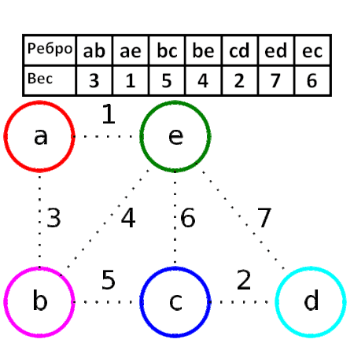

# SummerPractice

Репозиторий для летней практики 2020

## Спецификация:
### Описание задачи:

Визуализация работы алгоритма построения минимального остовного дерева (алгоритм Краскала).
	
## Теория

__Жадный алгоритм__ - на каждом шаге делается лучшая для данного момента операция.

Идея алгоритма в следующем - в множество __E'__ остовного дерева __G' = (V, E')__ графа __G = (V, E)__ в порядке невозростания весов добавляются рёбра.

- Если очередное ребро соединяет вершины одной компоненты связности __G'__, то добавление его создаст цикл.

- Если же оно соединяет вершины разных компонент, то по теореме о минимальном ребре оно безопасно и может быть включено в граф.

### Псевдокод

```
G = (V, E)      // исходный граф
G' = (V', E')   // результат алгоритма
V' ← V
E' ← ∅
for (uv ∈ E ordered by w(u,v))
	if (Component(u) ≠ Component(v))
        E' ← uv
```




## План выполенния

+ Обсуждение задания, распределение ролей, выбор необходимых средств разработки и структур данных
+ Реализация структур данных
+ Реализация алгоритма Краскала
+ Реализация прототипа GUI
+ Реализация графического ввода графа
+ Реализация основного GUI
+ Реализация дополнительного функционала GUI
+ Тестирование


### Распределение ролей
* Крыжановский Кирилл, гр. 8303
	+ разработка алгоритма
	+ gui
* Кибардин Антон, гр. 8303
	+ расширение возможностей gui
	+ оптимизирование алгоритмов
* Спирин Никита, гр. 8303
	+ тестирование
	+ слияние наработок

***


#### Информация по ведению проекта
* Делаем pull-request и описание к нему на _русском_ языке (чтобы нам легче понимать друг друга). 
* Commit'ы делать осмысленными. Чтобы не было что-то вроде _fix_, _some fixes_, и другое
* Текущие задачи отображаются в Issue. В них же указываются ошибки программы.
* Pull-request отображает выполнение одного (в некоторых случаях нескольких) пункта задач 


